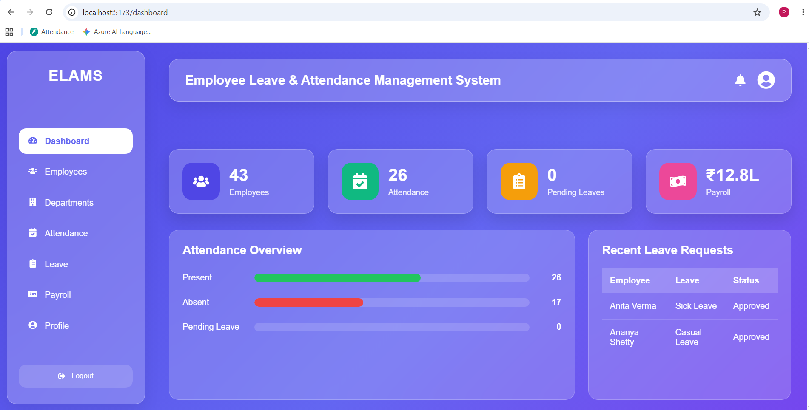
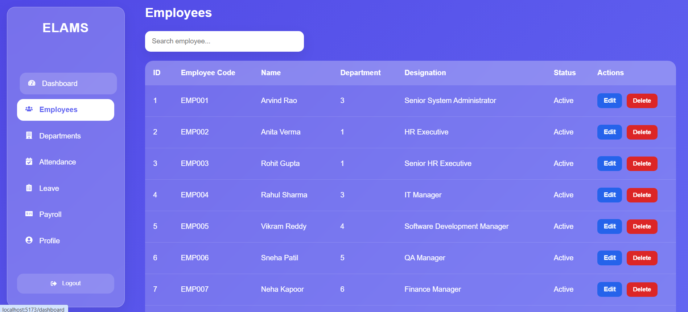
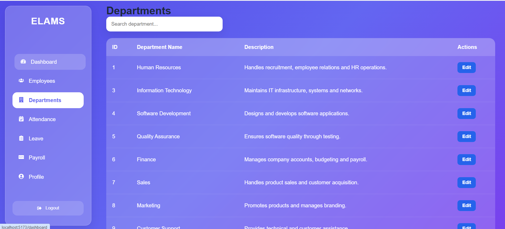
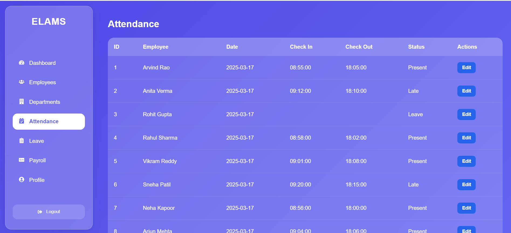
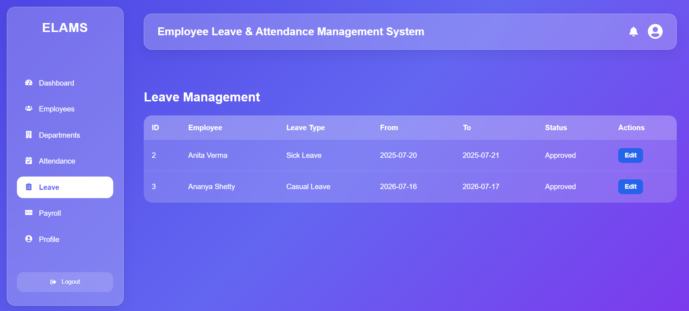
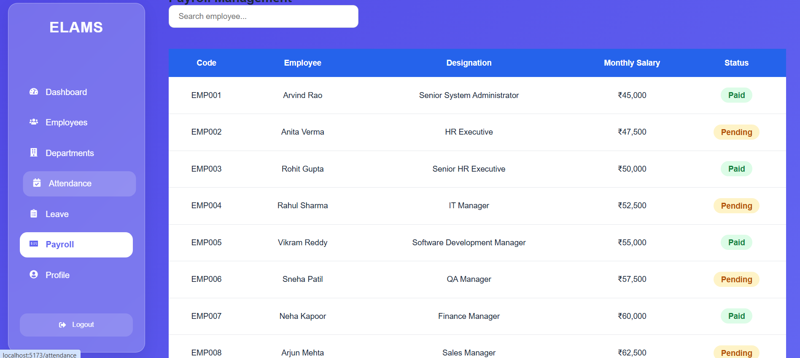
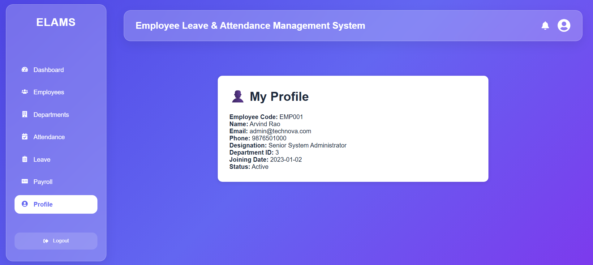
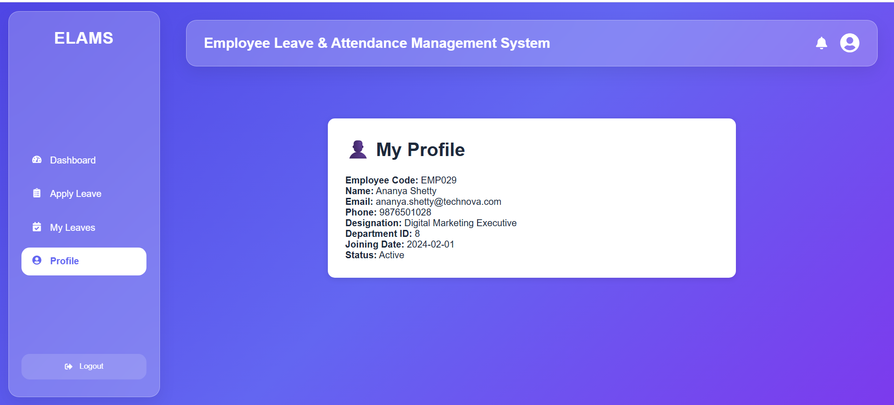
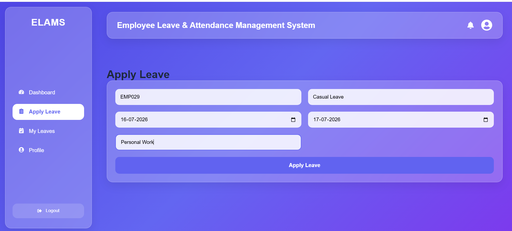
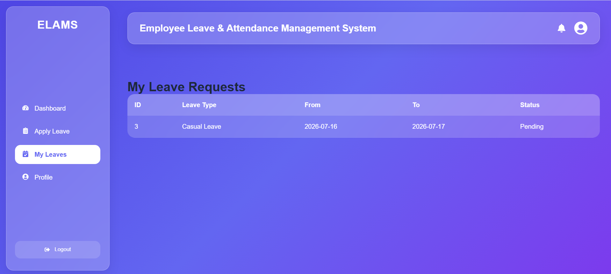

# Employee Leave & Attendance Management System (ELAMS)

A Full Stack Employee Leave & Attendance Management System developed using **FastAPI**, **React.js**, and **MySQL**. The system helps organizations efficiently manage employees, departments, attendance records, leave requests, payroll information, and role-based access through a secure web application.

---

## Features

- JWT Authentication
- Secure Login System
- Role-Based Access Control
- Dashboard Overview
- Employee Management
- Department Management
- Attendance Management
- Leave Management
- Payroll Management
- Employee Profile
- Search Functionality
- Responsive User Interface

---

## Tech Stack

### Frontend
- React.js
- React Router
- Axios
- CSS3

### Backend
- FastAPI
- SQLAlchemy ORM
- JWT Authentication
- Pydantic

### Database
- MySQL

---

## Modules

### Admin Module
- Dashboard
- Employee Management
- Department Management
- Attendance Management
- Leave Management
- Payroll Management
- Profile

### Employee Module
- Dashboard
- Apply Leave
- My Leaves
- Profile

---

# Screenshots

## Admin Dashboard



---

## Employee Management



---

## Department Management



---

## Attendance Management



---

## Leave Management



---

## Payroll Management



---

## Admin Profile



---

## Employee Dashboard



---

## Apply Leave



---

## My Leaves



---

## Employee Profile


---

## Project Structure

```text
ELAMS
│
├── backend
│   ├── app
│   ├── models
│   ├── routers
│   ├── schemas
│   ├── services
│   └── database.py
│
├── frontend
│   ├── src
│   │   ├── components
│   │   ├── pages
│   │   ├── services
│   │   └── styles
│
├── screenshots
│
└── README.md
```

---

## Future Enhancements

- Email Notifications
- Payroll Calculation
- Payslip Generation
- Leave Balance Calculation
- Attendance Analytics
- Employee Self-Service Payroll Portal
- Report Export (PDF / Excel)

---

## Learning Outcomes

This project helped me gain hands-on experience in:

- Full Stack Web Development
- FastAPI REST API Development
- React.js Frontend Development
- JWT Authentication
- Role-Based Authorization
- SQLAlchemy ORM
- CRUD Operations
- MySQL Database Design
- Git & GitHub Version Control

---

## Author

**Priya T**

Full Stack Developer

GitHub: https://github.com/Priya7705

---

## License

This project is developed for educational and learning purposes.
